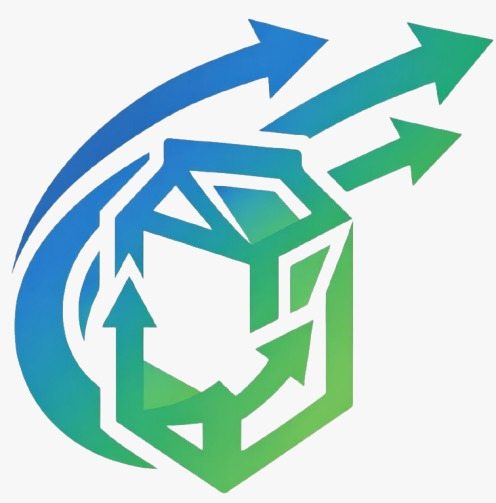
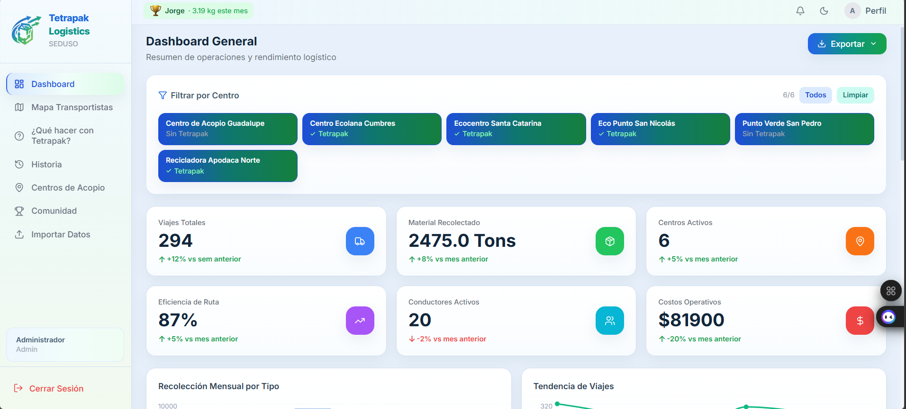

♻️ Tetrapak Logistics

  

<h1 align="center">Tetrapak Logistics</h1>

Plataforma inteligente para la logística del reciclaje de envases Tetrapak

Sistema web para optimizar la recolección y transporte de envases Tetrapak, conectando centros de acopio, transportistas y ciudadanos mediante mapas, dashboards y análisis logístico.

🧰 Tech Stack

      

🚀 Demo | Documentación

👉 Demo del sistema

👉 Manual de usuario

👉 Documentación del proyecto

✨ Features

📊 Dashboard Logístico

  

El dashboard muestra el estado general del sistema de reciclaje.

🔹 Número total de viajes logísticos

🔹 Toneladas de material recolectado

🔹 Centros de acopio activos

🔹 Conductores registrados

🔹 Costos operativos

🔹 Eficiencia de rutas

También incluye gráficas de análisis logístico para visualizar tendencias.

🗺️ Mapa de Transportistas

Mapa interactivo para planificar rutas de recolección.

🔹 Visualización de centros de acopio

🔹 Ubicación de transportistas

🔹 Selección de centros a visitar

🔹 Cálculo automático de rutas óptimas

🔹 Estimación de distancia y tiempo

🏭 Centros de Acopio

Permite localizar centros de reciclaje en la ciudad.

🔹 Ubicación en mapa interactivo

🔹 Horarios de operación

🔹 Materiales aceptados

🔹 Disponibilidad para Tetrapak

🌎 Comunidad

Sistema de participación ciudadana.

🔹 Reciclador del mes

🔹 Ranking de recicladores

🔹 Estadísticas de reciclaje

🔹 Actividad reciente

📥 Importación de Datos

Administradores pueden cargar información mediante archivos.

Tipos de datos soportados:

🔹 Centros de acopio

🔹 Viajes logísticos

🔹 Usuarios

Formatos permitidos:

        CSV
        XLS
        XLSX

👤 Perfil de Usuario

Gestión de cuenta dentro del sistema.

🔹 Información del usuario

🔹 Cambio de contraseña

🔹 Gestión de transportistas

🔹 Asignación de rutas

⚡ Quick Start

Clonar el repositorio

    git clone https://github.com/usuario/TetrapakLogistics.git

Entrar al proyecto

    cd TetrapakLogistics

Instalar dependencias

    npm install

Ejecutar servidor

    npm run dev

🧠 Arquitectura
Usuario

   │

Frontend (Vite + Tailwind)

   │

Backend (Node.js)

   │

Base de Datos

   │

Servicios de Mapas

📂 Estructura del Proyecto

TetrapakLogistics

│

├── backend

│

├── src

│

├── index.html

├── package.json

├── tailwind.config.js

├── vite.config.js

├── postcss.config.js

│

└── README.md

🤝 Colaboraciones

El proyecto considera la colaboración de organizaciones relacionadas con reciclaje.

🔹 Tetra Pak — soluciones de envasado y reciclaje

🔹 SEDUSO — políticas ambientales en Nuevo León

🔹 Ecolana — plataforma de centros de reciclaje

👨‍💻 Colaboradores

🔹 José Alejandro Zavala Manjarrez

🔹 Isaac Hernández Pérez

Tecnológico de Monterrey
Monterrey, Nuevo León

📝 Notas

El sistema también incluye funcionalidades adicionales.

🔹 Modo oscuro

🔹 Solicitudes de reciclaje

🔹 Estadísticas ambientales

🔹 Mapas interactivos

🔹 Seguimiento de actividad

Estas herramientas permiten mejorar la logística del reciclaje y fomentar la economía circular.

📜 License

MIT License

⭐ Support

Si te gusta el proyecto:

⭐ Dale Star al repositorio

♻️ Comparte el proyecto

🌎 Ayuda a promover el reciclaje

⭐ Dale Star al repositorio
♻️ Comparte el proyecto
🌎 Ayuda a promover el reciclaje
